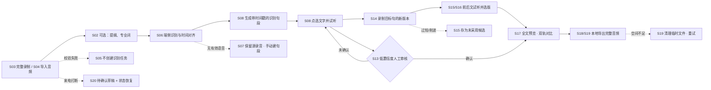

# AudioPatch 交互原型 · 设计说明与需求追溯

对应需求：《项目一需求规格说明》V1.1（2026-09-22）
原型文件：`AudioPatch-交互原型.html`（单文件、离线可开，双击即可运行）
原型版本：v1.0 · 21 屏 · 覆盖 21 条功能需求 / 13 条验收用例 / 12 条非功能需求中的 10 条

---

## 1. 怎么用这个原型

打开 HTML 后是三栏工作台：

| 元素 | 作用 |
| --- | --- |
| 左侧导航 | 按 6 个阶段（创建 / 识别 / 编辑 / 重录 / 成片 / 保障）排列 21 屏，点任意一项跳转 |
| 顶部「需求追溯标注」 | 开关屏幕内的需求编号标签。**关掉它就是一个干净的产品界面，打开它就是一页需求对照表** |
| 顶部「单屏 / 全部屏幕 / 流程地图」 | 单屏演示 / 21 屏总览（点缩略图可进入该屏）/ 主流程与门槛、异常出口 |
| 键盘 ← → | 在单屏模式下逐屏翻阅，适合答辩时讲解 |

屏幕内部是真交互，不是静态图：录音页计时与电平会走、重录会数 3-2-1 再进入录制态、审核清单必须逐项确认才会解锁导出按钮、导出有进行中/完成/被中断三个状态、点转写文字会联动磁带上的播放头。

---

## 2. 设计主张

### 2.1 视觉语义来自产品机制，不来自「录音 App」这个品类

产品的核心机制是**源录音不可变，成片只是编辑决策的组合**（§1.4 非破坏式替换、§2.6 局部替换规则）。所以界面里的颜色不是装饰，而是这套规则的可视语言：

| 颜色 | 语义 | 用在 |
| --- | --- | --- |
| 石墨黑 `#16191C` | 源录音 / 基准事实 | 源录音带的波形、转写正文、主按钮 |
| 钴蓝 `#2545D6` | 用户自己录进去的那一段 | 替换块、已替换标记、选用状态、主操作 |
| 琥珀 `#A9710A` | 需要人来判断的地方 | 低置信度文字下划线、待审核标签、门槛提示 |
| 红 `#BC3620` | 明确失败 | 校验失败、削波/过短、导出中断 |

### 2.2 签名元素：双轨磁带

全文预览页（S17）把「源录音带」与「成片时间轴」上下并排放：

- 上轨恒定、标着锁与校验值 `9f3c…a41d`，**从头到尾不变**；
- 下轨里被替换的句段是钴蓝色块，接缝处一枚橙色三角标；
- 两轨等宽同刻度，长度差 +0.2s 就写在标签里（`01:15.6 → 01:15.8`）。

一眼就能看懂「我只改了拼接决策，没动源文件」。紧凑版同一条带在编辑主页（S08）常驻底部，播放头同时受文字点击驱动——这就是需求里的「音频—文本—时间轴双向绑定」（P1-FR-008）。

### 2.3 字体分三声部

| 角色 | 字体 | 理由 |
| --- | --- | --- |
| UI 界面 | HarmonyOS Sans / PingFang SC | 目标机型就是鸿蒙手机，用系统字体而不是另选一款 |
| 转写文本与讲稿 | 衬线（Songti SC） | 转写文字是「别人说的话」，是阅读材料；衬线把它和界面控件区分开 |
| 时间戳 / 毫秒 / 置信度 | 等宽（SF Mono） | 读数据用等宽，`00:55.9 → 01:02.3` 能对齐着比 |

等宽字体所有数字都用 `tabular-nums`，句段列表里右列的时间与置信度可以竖着扫。

### 2.4 布局取舍

- 编辑主页的「重录这一句」是唯一的主按钮，48vp 高、整宽铺满（P1-NFR-009 要求主按钮 ≥48vp 且支持单手）；
- 转写句段按「句号卡片」排列而不是连续文本，因为每一句都要能被单独点选、单独重录；
- 首版所有处理都在本机，状态栏常驻「飞行模式」与「端侧」标记，把 P1-NFR-001 和 P1-AC-011 做进界面而不是只写进文档。

---

## 3. 屏幕清单

| 屏号 | 名称 | 阶段 | 关键内容 |
| --- | --- | --- | --- |
| S01 | 项目列表 | ① 创建 | 离线声明、新建入口、4 个项目状态（可编辑 / 已导出 / 待审核 / 待恢复） |
| S02 | 新建项目 | ① 创建 | 两种输入方式、可选的讲稿·提纲·专业词 |
| S03 | 完整录制 | ① 创建 | 连续录音、开始/暂停/继续/结束、实时电平、提纲参考面板 |
| S04 | 导入音频 | ① 创建 | 5 项识别前校验全部通过的状态 |
| S05 | 导入校验失败 | ① 创建 | 损坏/无音轨，不创建识别任务（异常分支） |
| S06 | 端侧识别处理中 | ② 识别 | 环形进度 + 四阶段、剩余时间、安全退出、模型版本 |
| S07 | 未检测到有效语音 | ② 识别 | 源录音仍可播放、重新识别、波形框选手动建立句段 |
| S08 | **编辑主页（核心）** | ③ 编辑 | 播放条、句段列表、低置信度标记、待审核入口、常驻磁带、重录主按钮 |
| S09 | 句段操作菜单 | ③ 编辑 | 改文字 / 调边界 / 拆分 / 合并 / 试听 / 版本 / 撤销 |
| S10 | 修改文字 | ③ 编辑 | 只改文字不动音频；改完审核状态回退 |
| S11 | 边界调整与拆分 | ③ 编辑 | 波形上拖两端、听边界、播放头处拆分、边界来源 |
| S12 | 合并与撤销 | ③ 编辑 | 合并预览、最近 4 步修改可逐步回退 |
| S13 | 低置信度人工审核 | ③ 编辑 | 逐项确认，未确认则导出被阻止 |
| S14 | 局部重录 · 回听与倒计时 | ④ 重录 | 回听上一句末尾 3 秒（不写入）、3-2-1 倒计时、录制中 |
| S15 | 候选版本列表 | ④ 重录 | 源录音 + v1/v2/v3 对比、质量检测结果、选用与恢复 |
| S16 | 上下文试听与停顿 | ④ 重录 | 前句—当前版本—后句连放、停顿 120ms、响度匹配、淡入淡出 |
| S17 | **全文预览 · 双轨对比** | ⑤ 成片 | 签名双轨磁带、跳转播放、听成片/听源录音 A/B |
| S18 | 导出设置 | ⑤ 成片 | 格式、参数、文件名、审核状态、不覆盖源录音的说明 |
| S19 | 导出中 / 完成 / 中断 | ⑤ 成片 | 三个状态、中断后保留编辑决策并可重试 |
| S20 | 打断恢复 · 待确认草稿 | ⑥ 保障 | 来电打断后的草稿、三条出路、上次已确认状态清单 |
| S21 | 项目信息与存储 | ⑥ 保障 | 数据/模型/审核策略/dspProfile 版本、存储占用、删除 |

---

## 4. 需求追溯

### 4.1 功能需求

| 需求 | 屏 | 原型里的实现 |
| --- | --- | --- |
| P1-FR-001 | S02 | 两种入口并列，各有说明与限制条件 |
| P1-FR-002 | S03 | 连续录音，暂停/继续/结束，时长 00:47.3 实时走，无按句操作 |
| P1-FR-003 | S04 / S05 | 校验结果逐条列出；失败时给出具体原因且不进识别 |
| P1-FR-004 | S02 | 文字区标「不填也能用」，空文本可直接走完全流程 |
| P1-FR-005 | S02 / S03 | 专业词 chips 辅助识别；录制页提纲仅作提词，注明「与口述不一致不中断」 |
| P1-FR-006 | S06 | VAD → 识别与时间戳 → 对齐 → 分句，四阶段显式可见 |
| P1-FR-007 | S06 / S08 | 句段带稳定序号、显示文字、源起止毫秒、置信度 |
| P1-FR-008 | S08 | 点文字 → 磁带播放头同步跳转；播放 → 句段高亮 + 底部进度线 |
| P1-FR-009 | S09–S12 | 改文字、合并、拆分、调边界四种操作各有独立入口与结果预览 |
| P1-FR-010 | S13 / S10 | 琥珀下划线 + 待审核标签；未确认导出按钮置灰并写明原因；改文字后状态回退为待审核 |
| P1-FR-011 | S14 | 回听上一句末尾 3 秒，明确写「不会写进替换录音」，随后倒计时 |
| P1-FR-012 | S15 | 每次重录生成独立版本，v1 3.0s / v2 6.6s 时长不同 |
| P1-FR-013 | S15 / S16 | 单选式选用，含「源录音（基准）」选项；选用后预览立即更新 |
| P1-FR-014 | S17 | 上轨源录音加锁恒定，下轨自动顺延 +0.2s |
| P1-FR-015 | S16 | 三张卡连放，停顿滑杆 0–600ms，响度匹配开关 |
| P1-FR-016 | S16 / S18 | 淡入淡出 10ms 只读展示，标注 `dspProfile v1.3`，说明历史修订不随默认值变化 |
| P1-FR-017 | S17 | 全文播放、逐句跳转、听成片 / 听源录音 A/B 切换 |
| P1-FR-018 | S18 / S19 | 导出新建文件，项目保持可编辑；成功页写明路径与大小 |
| P1-FR-019 | S20 | 自动保存后的状态清单（文字、边界、版本、采用版本、播放位置） |
| P1-FR-020 | S07 | 源录音可播放 + 重试识别 + 波形框选手动建立句段 |
| P1-FR-021 | S12 | 最近修改逐步回退，撤销后磁带与句段同步 |

### 4.2 验收用例

| 用例 | 屏 |
| --- | --- |
| P1-AC-001 / 002 无讲稿、仅提纲 | S01–S08 全流程无文字输入也能走通 |
| P1-AC-004 句段边界误差 | S11 边界调整页标注「自动边界误差 ≤ 500ms」并给出边界来源 |
| P1-AC-005 只用文字即可重录 | S08 → S14，全程不碰波形 |
| P1-AC-006 合并再拆分 | S12 合并预览 + S11 拆分点，均声明源录音校验值不变 |
| P1-AC-007 两个不同时长版本 | S15 两个版本 + S17 自动顺延 + 恢复源录音 |
| P1-AC-008 / 009 多处替换与一致性 | S17 双轨带 + 摘要（1 处替换、+0.2s）+「预览与导出读同一份编辑决策」 |
| P1-AC-010 强制结束恢复 | S20 恢复清单 |
| P1-AC-011 飞行模式 | 状态栏飞行模式常驻，S06 写明「本机 · 未使用网络」 |
| P1-AC-012 四类异常 | S05 / S07 / S19（中断）/ S20（打断） |
| P1-AC-013 低置信审核 | S13 三种情形（低于阈值 / 置信度不可用 / 策略缺失）+ 导出被阻止 + 确认后解锁 |

### 4.3 非功能需求

| 需求 | 屏 / 说明 |
| --- | --- |
| P1-NFR-001 离线 | 状态栏飞行模式 + S04/S06/S17 的端侧说明 |
| P1-NFR-002 隐私 | S01 底部说明、S21 项目与存储 |
| P1-NFR-003 源素材保护 | S04 导入副本说明、S17 上轨加锁、S18 不覆盖提醒 |
| P1-NFR-004 删除 | S21 危险区，列明同步删除的四类数据 |
| P1-NFR-005 可靠性 | S19 中断态：临时文件不计为成功文件 |
| P1-NFR-006 可恢复 | S20 |
| P1-NFR-007 响应反馈 | S06 进度与剩余时间；所有按钮有按下态 |
| P1-NFR-008 模型一致性 | S06 / S21 记录 ASR 模型版本，重启不重复识别 |
| P1-NFR-009 易用性 | S08 底部 48vp 主按钮「重录这一句」 |
| P1-NFR-012 可维护性 | S21 数据版本 `schema 3 · 可迁移`，迁移失败保留副本 |

**原型未覆盖的两条，需要开发阶段补：**

- P1-NFR-010 无障碍：原型只做到「状态用文字 + 视觉双标记」和给按钮补了语义标签；系统字号放大后的重排、TalkBack 朗读顺序需要实机验证。
- P1-NFR-011 资源管理：模型体积、峰值内存、最低配置必须在模型选型后实测，属选型阶段交付物。

另外，性能目标「5 分钟录音转写与分句 ≤ 60 秒」在原型里只体现为进度反馈，数值需实机基准复核。

---

## 5. 几处需要你确认的取舍

1. **审核门槛做成了硬闸门。** 需求里「审核未完成时导出被明确阻止」有歧义：是完全不给导出按钮，还是给按钮但点下去报错。原型选了后者（按钮置灰 + 写明「还有 2 处未确认」），因为报错信息本身能告诉用户缺什么。如果你们希望更硬，可以改成不显示导出入口。
2. **专业词辅助的可见度。** 原型让专业词以 chips 形式出现在新建项目和改文字两个地方；如果模型侧不支持热词增强，S02 里这句「辅助本机识别」需要改措辞。
3. **恢复流程只做了一个分支。** 录制打断（S20）与识别失败（S07）是两个出口，但「存储不足」目前只在导出中断（S19）里出现一次，没有独立的存储不足页面——因为它需要的是清理动作而不是一个页面。
4. **没有做首屏空状态。** 假定演示机里已有项目。如果要给评委看「第一次打开」，需要补一个 S00。
5. **P2 项全部未画。** 多说话人分离、背景音乐多轨、多语言、跨设备协作都不在首版，原型里没有留入口。

---

## 6. 主流程图（含门槛与异常出口）

门槛放在「点选文字并试听」与「全文预览」之间，与 P1-FR-010 的描述一致：审核不阻止修改和试听，只阻止发布。
