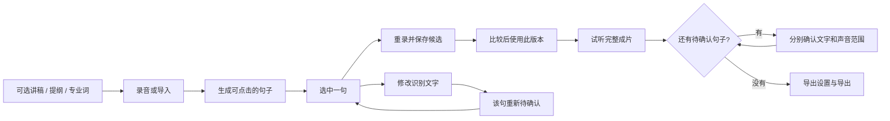

# AudioPatch 交互原型 · 设计说明与需求追溯

对应需求：《项目一需求规格说明》V1.1（2026-09-22）。
原型文件：`AudioPatch-交互原型.html`，单文件，可离线打开。
原型版本：v1.1（2026-10-09），21 个页面定义。

## 1. 使用方式与能力边界

默认打开用户视图，隐藏左侧页面导航和需求标注。首页用“录完一整段，只重录其中一句”解释产品；只有一个明确标为示例的项目，不再让不同项目卡跳转到不相关的固定句子。

顶部“展开演示导航”可恢复答辩工作台，提供单屏、全部屏幕和流程地图。左右方向键只在演示模式且焦点不在输入控件中时翻页，避免打断文字编辑。需求编号标注默认关闭；动态核心页面以本文件的追溯表为准。

**这是交互原型，不是已接通音频能力的应用。** 录音波形、计时、识别进度、导出进度均是演示；不会访问麦克风、播放真实音频、运行 ASR 或创建音频文件。试听与未实现操作会明确提示。文字、选句、确认状态、补录候选及采用版本在当前页面会话内联动；刷新后重置。HarmonyOS 的正式应用仍须使用 ArkTS / ArkUI、Stage 模型与 SDK 6.0.0（API 20），并完成官方能力接入与实机验证。

## 2. 面向首次使用者的交互规则

1. **先理解目标。** 首页用录音/导入 → 点选文字 → 重录 → 导出的任务语言，不要求先理解时间轴、端侧 ASR 或非破坏式编辑。
2. **文字不是前置条件。** 新建页以原生折叠区提供有标签的讲稿、提纲和专业词输入。均可留空，提纲进入录音页显示。原型不声称这些输入已用于模型识别。
3. **明确操作对象。** 编辑页初始无选句，“先选择一句”不可用；点击后显示“已选中第 n 句”与“重录第 n 句”。改字、重录、版本列表、前后文页面均使用该选择。
4. **区分改字和改声音。** “修改识别文字”说明只修正文字，想改变说出的内容必须重录。保存改动后，该句的文字和声音范围确认均失效。
5. **区分比较和使用。** 版本列表单选只切换候选，不改变成片；点击“使用此版本”才采用，并明确反馈。恢复原音后，替换数量、成片时长与时间轴同步重算。
6. **检查是明确任务。** “待人工审核”面向用户称为“检查并确认”。文字一致、声音范围完整分别确认，仍遵守 P1-FR-010 的硬门槛。
7. **导出入口可发现。** 未完成检查时，编辑页、全文预览、演示导航等导出入口统一引导检查；不会进入导出任务。检查完成后继续到导出设置，改字后再次拦截。
8. **渐进展示参数。** 上下文试听的停顿与音量设置放入“更多声音设置”，DSP 版本放入技术详情；默认重点是当前句和前后文。
9. **不要提前开口。** 倒计时中提示等待，结束后才进入录制态；第一句不提供不存在的上一句回听。模拟录制仅新增候选，不自动采用。
10. **高级操作提前解释后果。** 声音范围、合并与拆分示例说明旧补录可能不兼容、成片恢复原音且需要重新检查。此轮仅展示这些设计，保存按钮不伪装已修改数据。

“原始录音 / 补录 / 当前使用 / 可能识别不准 / 检查并确认”是用户语言；领域模型仍使用 `SourceAudio`、`ReplacementTake`、`reviewGate` 等名称。

## 3. 页面与功能追溯

“设计展示”仅表示画出了状态，不等于需求已经实现或通过验收。

| 需求 | 页面 | v1.1 原型状态 |
| --- | --- | --- |
| P1-FR-001 | S01–S02 | 两种输入入口，首页任务说明与单一示例项目 |
| P1-FR-002 | S03 | 连续录音状态模拟，不产生源音频 |
| P1-FR-003 | S04–S05 | 导入校验成功/失败设计展示，无系统文件选择器 |
| P1-FR-004 | S02 | 三种文字均可留空，原生输入控件可操作 |
| P1-FR-005 | S02–S03 | 提纲显示联动，专业词识别能力尚未接入 |
| P1-FR-006 | S06 | 用自然语言说明生成文字、对应声音和整理句子；进度为模拟 |
| P1-FR-007 | S08 | 示例句子有稳定 ID、文字与原音时间范围；默认不展示置信度数值 |
| P1-FR-008 | S08、S17 | 选句高亮与时间轴设计；真实播放双向同步待正式应用实现 |
| P1-FR-009 | S09–S12 | 改字状态联动；范围、合并、拆分仅设计示例 |
| P1-FR-010 | S10、S13 | 双项确认、改字失效和全入口导出拦截已联动 |
| P1-FR-011 | S14 | 目标句、第一句边界、倒计时联动；回听无真实音频 |
| P1-FR-012 | S14–S15 | 停止模拟录制新增当前句候选，不自动替换 |
| P1-FR-013 | S15 | 候选与采用分离，可恢复原音，采用后重算成片 |
| P1-FR-014 | S17 | 双轨与时长按当前使用版本更新，无真实文件校验 |
| P1-FR-015 | S16 | 前后文使用实际选句，停顿设置可操作；无真实声音处理 |
| P1-FR-016 | S16、S18、S21 | 技术详情展示 DSP 配置；版本化渲染在正式应用实现 |
| P1-FR-017 | S17 | 成片/原音试听入口，动态摘要；真实试听未接通 |
| P1-FR-018 | S18–S19 | 格式与文件后缀联动，模拟进度和完成态；不生成文件 |
| P1-FR-019 | S20 | 恢复设计展示；页面刷新不会恢复编辑状态 |
| P1-FR-020 | S07 | 无有效语音时的重试/手动处理设计展示 |
| P1-FR-021 | S12 | 撤销设计示例，尚未实现编辑历史撤销 |

## 4. 验证与正式验收的区别

`tests/prototype.cjs` 使用 Playwright 与本机 Chrome 检查浏览器交互。运行环境需提供 Node.js 和 Playwright：

```sh
NODE_PATH=/path/to/node_modules node tests/prototype.cjs
```

自动化覆盖选句目标、改字联动、两项确认、重新检查、统一导出门槛、格式后缀、候选与采用、恢复原音及小屏横向溢出。截图用于视觉检查，不是音频质量验证。

P1-AC-001—013 仍需正式应用与真实音频验收：尤其是识别准确率、时间边界、真实补录与拼接、预览/导出一致性、飞行模式、异常恢复和策略版本变化，不能由 HTML 演示代替。自动边界误差目标不再作为已达成保证展示。

非功能设计保留离线隐私、原音保护、中断恢复和迁移说明；没有通过原型证明 NFR 达标。主要按钮使用 48px，控件有标签与可见键盘焦点，并增加小屏适配。ArkUI 的 48vp、系统字号、读屏与单手可达性仍需鸿蒙实机测试。

## 5. 保留的限制与后续验证

- 新建/导入仍进入固定示例素材，不能用来测试真实多项目持久化；不宣称创建真实项目。
- 音频录制、播放、识别、DSP、导出、分享、删除和异常恢复仍是设计/模拟。
- 波形编辑与历史撤销没有数据实现，不可据此宣布通过 P1-AC-006。
- 确认 UI 在无真实声音时仅演示状态门槛；正式应用需让用户实际试听，并按详细设计保存版本绑定的批准凭据。
- 后续应邀请未看过演示的目标用户独立完成“导入—改一句—采用—检查—导出”，记录任务成功率、误操作和需要帮助的位置；本次不是实测用户研究。

## 6. 用户主流程



检查不阻止编辑或试听，只阻止实际导出。该基线未降低。
