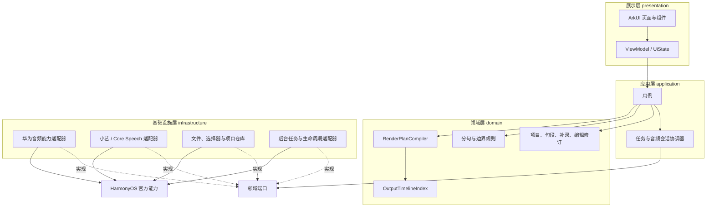
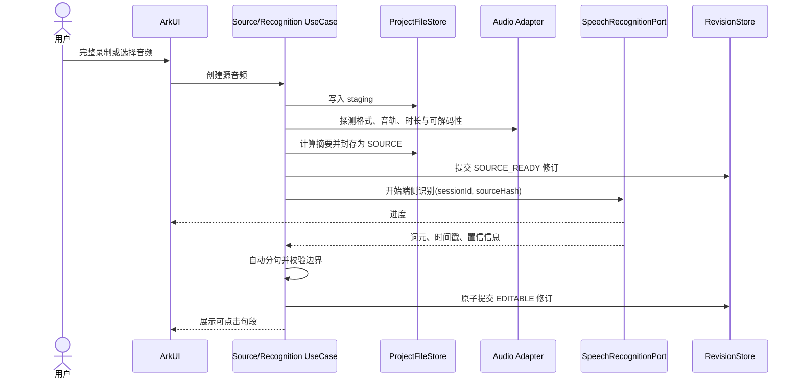
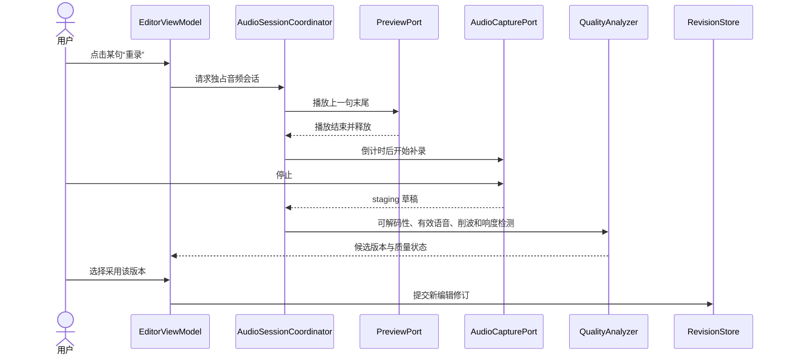
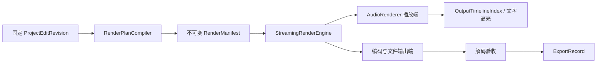
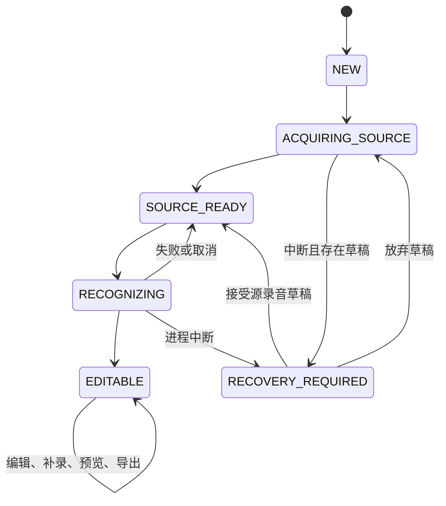

# AudioPatch——项目一架构设计

文档版本：V1.0  
文档状态：开发基线  
编制日期：2026-09-21  
需求基线：[项目一需求规格说明.md](./项目一需求规格说明.md) V1.0  
技术基线：ArkTS、ArkUI、HarmonyOS Stage 模型  
兼容版本：HarmonyOS SDK 6.0.0（API 20）

## 1. 架构目标

`AudioPatch` 解决的核心问题是：一段完整录音中只有少数句子需要修改时，用户能够通过文字找到这些句子并单独补录，不必重录全文，也不必手工操作复杂波形。

架构围绕一个机制展开：**源录音保持不可变，识别句段绑定源录音时间范围，所有修改形成编辑决策，再由同一份渲染清单驱动预览与导出。**

这条机制需要同时保证四件事：

1. 识别文字可以定位源录音，补录变长或变短时仍不破坏原始时间坐标；
2. 修改文字、调整边界、选择补录、改变停顿都不覆盖源录音；
3. 相邻或不相邻的多处替换不会造成漏句、重复和顺序错误；
4. 全文预览与最终导出对同一项目修订产生完全相同的节点顺序和处理参数。

首版采用单 HAP。应用主体使用 ArkTS 和 ArkUI；页面、业务规则、状态管理、项目存储和任务协调全部使用 ArkTS。若 API 20 只为帧级音频编解码提供 Native API，则只在 `audio_native` 中建立最小桥接层，业务层仍只依赖 ArkTS 端口。

## 2. 架构约束与边界

### 2.1 固定约束

- `compatibleSdkVersion` 固定为 HarmonyOS SDK 6.0.0（API 20）。
- 正式功能中的录音、识别、分句、补录、预览和导出必须在飞行模式下运行。
- 音频、提纲、转写文本、识别中间结果和编辑记录保存在应用私有目录。
- 系统能力优先使用华为官方 API；官方调用未核实时只完成端口、适配器、状态和错误路径，并保留 `TODO(HUAWEI_API)`。
- 源录音完成封存后只能读取，任何编辑命令都无权覆盖它。
- 正式构建不包含静态识别结果、随机模型输出或把失败转换成空成功的逻辑。

### 2.2 首版系统边界

系统内部负责单说话人普通话录音、音频导入、端侧识别、分句、文本定位、补录选版、时间轴编译、全文预览、导出、自动保存和异常恢复。

账号、云同步、协作编辑、多说话人分离、背景音乐多轨混音和视频编辑不进入首版架构。应用不声明网络权限，核心流程也不建立任何网络客户端。

## 3. 总体架构



依赖方向固定为：

```text
presentation → application → domain
infrastructure → domain 中定义的端口
composition → 组装全部实现
```

页面不得直接持有录音器、播放器、文件句柄、识别会话或编解码器。领域层不读取 HarmonyOS 上下文，不知道真实文件路径，也不引用具体华为返回类型。这样，小艺能力或媒体 API 的签名变化只影响一个适配器。

## 4. 模块划分

| 模块 | 核心职责 | 对应需求 |
| --- | --- | --- |
| `ProjectApplication` | 新建、打开、删除、保存和恢复项目 | P1-FR-001、019 |
| `SourceAcquisition` | 完整录音、暂停继续、导入、校验和封存源音频 | P1-FR-002、003 |
| `Recognition` | 端侧识别、时间对齐、进度、取消、模型信息 | P1-FR-004—006 |
| `TranscriptEditing` | 自动分句、改字、合并、拆分、边界调整、低置信标记 | P1-FR-007—010、020 |
| `ReplacementRecording` | 上下文提示、倒计时、多版本补录、质量检测和选版 | P1-FR-011—013 |
| `TimelineDomain` | 非破坏式编辑、停顿、淡入淡出、响度与版本一致性 | P1-FR-014—016、021 |
| `PreviewAndExport` | 时间轴播放、文字同步、高亮、导出和导出记录 | P1-FR-017、018 |
| `Recovery` | 操作日志、草稿恢复、损坏检测和孤立文件清理 | P1-NFR-005、006、012 |

## 5. 代码目录

```text
entry/src/main/ets/
├── entryability/
│   └── EntryAbility.ets
├── composition/
│   ├── AppContainer.ets
│   └── ApplicationLifecycleCoordinator.ets
├── presentation/
│   ├── navigation/
│   ├── pages/
│   │   ├── ProjectListPage.ets
│   │   ├── ProjectCreatePage.ets
│   │   ├── SourceCapturePage.ets
│   │   ├── RecognitionPage.ets
│   │   ├── TranscriptEditorPage.ets
│   │   ├── ReplacementTakePage.ets
│   │   └── ExportPage.ets
│   ├── components/
│   │   ├── TranscriptSegmentItem.ets
│   │   ├── ContextPreviewBar.ets
│   │   ├── RecordingControl.ets
│   │   └── OperationProgressView.ets
│   ├── state/
│   └── viewmodel/
├── application/
│   ├── usecase/
│   │   ├── CreateProjectUseCase.ets
│   │   ├── CaptureSourceAudioUseCase.ets
│   │   ├── ImportSourceAudioUseCase.ets
│   │   ├── RecognizeSourceAudioUseCase.ets
│   │   ├── EditTranscriptUseCase.ets
│   │   ├── RecordReplacementTakeUseCase.ets
│   │   ├── SelectTakeUseCase.ets
│   │   ├── PreviewTimelineUseCase.ets
│   │   ├── ExportTimelineUseCase.ets
│   │   └── RecoverProjectUseCase.ets
│   ├── coordinator/
│   │   ├── AudioSessionCoordinator.ets
│   │   ├── RecognitionCoordinator.ets
│   │   ├── RenderCoordinator.ets
│   │   └── RecoveryCoordinator.ets
│   └── dto/
├── domain/
│   ├── model/
│   ├── service/
│   │   ├── TranscriptSegmentService.ets
│   │   ├── RenderPlanCompiler.ets
│   │   ├── OutputTimelineIndex.ets
│   │   ├── SegmentValidationService.ets
│   │   └── EditHistoryService.ets
│   ├── port/
│   └── error/
├── infrastructure/
│   ├── huawei/
│   │   ├── audio/
│   │   ├── speech/
│   │   │   ├── CoreSpeechTranscriptAdapter.ets
│   │   │   ├── XiaoyiTimedAlignmentAdapter.ets
│   │   │   └── TimedRecognitionFacade.ets
│   │   ├── file/
│   │   ├── permission/
│   │   └── lifecycle/
│   ├── persistence/
│   │   ├── FileProjectRepository.ets
│   │   ├── AppendOnlyRevisionStore.ets
│   │   └── ProjectMigrationRegistry.ets
│   └── diagnostics/
└── common/
    ├── result/
    ├── cancellation/
    ├── concurrency/
    └── validation/

entry/src/main/resources/base/element/
├── string.json
├── color.json
└── float.json
```

如果 API 20 的帧级解码、编码与封装只能通过官方 Native API 完成，再增加：

```text
entry/src/main/cpp/audio_native/
├── audio_codec_bridge.cpp
├── audio_demuxer_bridge.cpp
├── audio_muxer_bridge.cpp
└── napi_init.cpp
```

该目录只进行官方媒体 API 与 ArkTS DTO 的转换，不包含句段、选版和时间轴业务规则。

## 6. 核心领域模型

### 6.1 两套时间坐标

项目持久化统一使用整数微秒，所有范围采用左闭右开形式 `[startUs, endUs)`。相邻范围 `[a,b)` 与 `[b,c)` 在采样点层面不会重叠。

- `sourceRange`：句段在不可变源录音中的位置，补录时长变化不会修改它。
- `outputRange`：句段在当前成片中的位置，每次编译渲染清单时重新计算。

写入前必须验证时间是安全整数，并满足：

```text
0 <= startUs < endUs <= asset.durationUs
previous.endUs <= next.startUs
```

渲染时只在计划编译阶段把时间边界换算成帧编号，同一边界复用同一个结果。输出位置使用目标采样率下的整数帧累计，避免反复进行浮点换算。

### 6.2 主要数据类型

```ts
type ProjectId = string;
type AssetId = string;
type SegmentId = string;
type TakeId = string;
type RevisionId = string;

interface TimeRangeUs {
  startUs: number;
  endUs: number;
}

interface AudioAsset {
  assetId: AssetId;
  kind: 'SOURCE' | 'REPLACEMENT_RAW' | 'DERIVED_CACHE';
  privateRelativePath: string;
  contentHash: string;
  byteLength: number;
  durationUs: number;
  sampleRateHz: number;
  channelCount: number;
  codec: string;
  container: string;
  createdAtMs: number;
}

interface WordToken {
  tokenId: string;
  text: string;
  sourceRange: TimeRangeUs;
  confidence?: number;
}

interface TranscriptSegment {
  segmentId: SegmentId;
  order: number;
  tokenIds: Array<string>;
  displayText: string;
  sourceRange: TimeRangeUs;
  confidence?: number;
  boundaryOrigin: 'ASR' | 'USER' | 'MANUAL';
  textRevision: number;
  rangeRevision: number;
  derivedFromSegmentIds: Array<SegmentId>;
}

interface ReplacementTake {
  takeId: TakeId;
  targetSegmentId: SegmentId;
  targetRangeRevision: number;
  rawAssetId: AssetId;
  contentRange: TimeRangeUs;
  state: 'RECORDING_DRAFT' | 'READY' | 'QUALITY_WARNING' | 'UNAVAILABLE';
  speechLevelDb?: number;
  peakDbfs?: number;
  createdAtMs: number;
}

interface SegmentEditDecision {
  segmentId: SegmentId;
  targetRangeRevision: number;
  selectionKind: 'SOURCE' | 'TAKE';
  selectedTakeId?: TakeId;
  gainDb: number;
  fadeInUs: number;
  fadeOutUs: number;
}

interface TransitionDecision {
  leftSegmentId: SegmentId;
  rightSegmentId: SegmentId;
  leftRangeRevision: number;
  rightRangeRevision: number;
  mode: 'PRESERVE_SOURCE' | 'FIXED_SILENCE';
  fixedSilenceUs: number;
}

interface ProjectEditRevision {
  schemaVersion: number;
  revisionId: RevisionId;
  parentRevisionId?: RevisionId;
  sequence: number;
  projectId: ProjectId;
  sourceAssetId: AssetId;
  recognitionResultId?: string;
  segments: Array<TranscriptSegment>;
  takes: Array<ReplacementTake>;
  segmentDecisions: Array<SegmentEditDecision>;
  transitionDecisions: Array<TransitionDecision>;
  dspProfileVersion: number;
  createdAtMs: number;
  stateHash: string;
}
```

`WordToken` 保存模型原始文字和源时间坐标，不随用户改字、合并或拆分而覆盖。用户最终看到的内容保存在 `TranscriptSegment.displayText`。

置信度使用可选字段，因为华为公开能力是否在 API 20 返回稳定的词级置信度仍需确认。适配器缺少该字段时必须标记为“未提供”，不能自行生成数值。

### 6.3 句段变更规则

- 修改显示文字：保留 `segmentId` 和 `rangeRevision`，只增加 `textRevision`。
- 调整边界：保留 `segmentId`，增加 `rangeRevision`。
- 合并句段：创建新 `segmentId`，记录被合并句段 ID。
- 拆分句段：创建两个新 `segmentId`，共同记录来源句段 ID。
- 边界版本变化后，绑定旧 `rangeRevision` 的补录进入“不兼容”状态，当前采用版本恢复源录音。
- 合并或拆分后，旧补录保留在历史修订中，不自动应用到新句段。
- 撤销操作创建一个新的项目修订，使当前内容恢复到目标历史状态；不移动 `HEAD` 到过去，也不删除后续资产。

这些规则防止一段为旧范围录制的声音被静默套用到新的句段边界。

## 7. 非破坏式时间轴内核

### 7.1 渲染清单

预览与导出共同使用不可变的 `RenderManifest`：

```ts
interface FrameRange {
  startFrame: number;
  endFrame: number;
}

interface RenderAtom {
  atomId: string;
  kind: 'AUDIO' | 'SILENCE';
  assetId?: AssetId;
  assetFrameRange?: FrameRange;
  ownerSegmentId?: SegmentId;
  outputStartFrame: number;
  outputFrameCount: number;
  gainDb: number;
  fadeInFrames: number;
  fadeOutFrames: number;
}

interface RenderManifest {
  projectId: ProjectId;
  editRevisionId: RevisionId;
  sourceContentHash: string;
  compilerVersion: number;
  dspProfileVersion: number;
  sampleRateHz: number;
  channelCount: number;
  sampleFormat: string;
  atoms: Array<RenderAtom>;
  totalOutputFrames: number;
  manifestHash: string;
}
```

导出开始时固定 `editRevisionId` 和 `manifestHash`。用户随后继续编辑，只会生成新的修订，不改变已经运行的导出任务。

### 7.2 编译算法

识别句段之间可能存在呼吸、环境声和自然停顿。算法不能只拼接句段本身，而要保留没有被句段覆盖的源音频。

```text
compile(revision):
  1. 校验源资产、句段、补录资产、边界版本和全部引用
  2. 按 sourceRange.startUs 排序并拒绝重叠句段
  3. 若没有句段，输出 SourceAudio[0, sourceDuration)
  4. 输出首句之前的 SourceAudio[0, first.start)
  5. 按顺序处理每个句段：
       a. 选择 SOURCE 时输出源范围
       b. 选择 TAKE 时验证 take.targetRangeRevision，再输出补录 contentRange
       c. 对句间区域选择保留源间隙或输出用户设置的固定静音
  6. 输出末句之后的 SourceAudio[last.end, sourceDuration)
  7. 合并连续、同源且参数一致的节点
  8. 换算到统一输出格式，累计 outputStartFrame
  9. 生成规范序列化结果和 manifestHash
```

该算法产生以下确定行为：

- 补录更长时，后续输出位置整体后移；补录更短时整体前移；
- 多个相邻句段都被替换时按句段顺序加入，不重复原句；
- 用户未修改停顿时保留源录音的句间声音；
- 全部选择源录音且保留默认停顿时，清单可合并为完整源音频；
- “前句—当前句—后句”试听从完整清单裁出子计划，不建立另一套拼接规则。

### 7.3 流式渲染

`StreamingRenderEngine` 按固定大小的 PCM 块处理音频，项目时长不会线性增加峰值内存：

```text
读取资产指定范围
→ 解码为 PCM
→ 声道和采样率转换
→ 静音边界修整
→ 应用增益
→ 应用短淡入淡出
→ 写入 AudioRenderer 或编码输出端
```

播放端和导出端只替换末端 `RenderSink`。播放器依据 `outputStartFrame` 二分查找当前节点并高亮文字；点击文字则从 `OutputTimelineIndex` 取得该句当前成片位置。

首版淡入淡出默认值建议为 10～15 毫秒，并限制为有效内容时长的一半以内。响度匹配的测量值、算法版本和最终增益写入编辑修订。源文件和补录原件均不进行覆盖式处理。

## 8. 领域端口与适配器

```ts
interface AudioCapturePort {
  prepare(request: CaptureRequest): Promise<AppResult<CaptureSession>>;
  pause(sessionId: string): Promise<AppResult<void>>;
  resume(sessionId: string): Promise<AppResult<void>>;
  stop(sessionId: string): Promise<AppResult<CapturedDraft>>;
  cancel(sessionId: string): Promise<AppResult<void>>;
}

interface SpeechRecognitionPort {
  recognize(
    request: RecognitionRequest,
    observer: RecognitionObserver,
    cancellation: CancellationToken
  ): Promise<AppResult<RecognitionResult>>;
}

interface AudioRenderPort {
  preview(manifest: RenderManifest, range?: FrameRange): Promise<AppResult<PlaybackSession>>;
  export(manifest: RenderManifest, target: ExportTarget,
    observer: RenderObserver, cancellation: CancellationToken): Promise<AppResult<ExportedAudio>>;
}
```

其他端口包括 `AudioImportPort`、`AudioProbePort`、`AudioDecodePort`、`AudioEncodePort`、`ProjectRepository`、`ProjectFileStore`、`HashPort` 和 `BackgroundJobPort`。

所有端口返回统一 `AppResult`。错误对象包含 `code`、`operation`、`userMessageKey`、`recoverable`、`recommendedAction`、`sessionId` 和 `technicalCause`。空数组、空字符串或缺少文件不能表示成功。

## 9. 华为官方能力映射

下表把内部端口与官方能力隔离开。标为“接入前验证”的项目必须在 API 20 SDK、目标真机和飞行模式下完成技术验证后才能写入正式适配器。

| 内部能力 | 首选官方能力 | 架构使用方式 | 当前结论 |
| --- | --- | --- | --- |
| 麦克风授权 | Ability Kit 的访问控制能力，权限 `ohos.permission.MICROPHONE` | 进入录音动作时申请，拒绝后保留项目 | 官方录音文档已确认权限；具体 API 20 方法签名在工程中编译确认 |
| 完整录音与补录 | Media Kit `AVRecorder` API 9+，或 Audio Kit `AudioCapturer` API 8+ | `AVRecorder` 支持 `prepare → start → pause/resume → stop → release` 并生成封装文件；`AudioCapturer` 只输出 PCM | API 20 可用；最终录音实现由中断草稿与 ASR 音频链路实测决定 |
| PCM 播放 | Audio Kit `AudioRenderer` API 8+ | 共同渲染引擎的预览输出端 | API 20 可用，官方明确用于 PCM 播放和播放前处理 |
| 普通媒体播放 | Media Kit `AVPlayer` API 9+ | 源文件快速试听、seek 和导出文件验收 | API 20 可用；状态机仍需做契约测试 |
| 音频选择与导出位置 | Core File Kit `AudioViewPicker`、`DocumentViewPicker` API 9+ | 只取得用户选择的 URI/文件描述符，不申请广泛存储权限 | API 20 可用，只能由 UIAbility 拉起 |
| 私有文件 | Core File Kit 文件管理能力 | 暂存、封存、修订、缓存和清理 | 只在项目仓库适配器内调用 |
| 音频探测 | Media Kit `AVMetadataExtractor` 或对应媒体探测能力 | 检查时长、轨道、格式和可解码性 | 接入前验证 API 20 支持的字段和错误码 |
| 帧级解码、编码和封装 | AVCodec Kit `OH_AVSource`/`OH_AVDemuxer` API 10+、`OH_AudioCodec` API 11+、`OH_AVMuxer` API 10+ | 通过最小 Node-API 桥接实现 PCM 流水线 | API 20 可用；运行时先查询目标设备支持的编解码规格 |
| 离线全文转写 | Core Speech Kit `speechRecognizer` API 11+ | `CoreSpeechTranscriptAdapter` 输入 16 kHz、16 bit、单声道 PCM 流 | API 20 可用；`online=1` 为官方定义的离线模式，公开结果只有文本与完成状态 |
| 带时间定位的识别 | 小艺公开端侧语音能力 | `XiaoyiTimedAlignmentAdapter` 输出带时间范围的词元 | 尚未从公开官方 API 确认；这是 P1-FR-006 的阻断项 |
| 耗时本地任务 | ArkTS TaskPool 或 Worker | 波形、摘要、分句、清单编译和可在后台安全运行的音频处理 | 任务对象只传可序列化数据；系统媒体对象留在适配器所属线程 |

官方资料：

- [音频录制方案概述](https://developer.huawei.com/consumer/cn/doc/doccenter-feature-dev/bpta-audio-record-overview)
- [AVRecorder API](https://developer.huawei.com/consumer/cn/doc/harmonyos-references/arkts-apis-media-avrecorder)
- [AudioCapturer API](https://developer.huawei.com/consumer/cn/doc/harmonyos-references/arkts-apis-audio-audiocapturer)
- [AVPlayer API](https://developer.huawei.com/consumer/cn/doc/harmonyos-references/arkts-apis-media-avplayer)
- [使用 AudioRenderer 播放 PCM](https://developer.huawei.com/consumer/cn/doc/HarmonyOS-Guides/using-audiorenderer-for-playback)
- [Core File Kit 文件选择器](https://developer.huawei.com/consumer/en/doc/harmonyos-references/js-apis-file-picker)
- [speechRecognizer API](https://developer.huawei.com/consumer/cn/doc/harmonyos-references/hms-ai-speechrecognizer)
- [Core Speech Kit](https://developer.huawei.com/consumer/cn/sdk/core-speech-kit/)
- [AVCodec AudioCodec](https://developer.huawei.com/consumer/cn/doc/harmonyos-references/capi-native-avcodec-audiocodec-h)
- [获取设备支持的编解码能力](https://developer.huawei.com/consumer/cn/doc/harmonyos-guides-V5/obtain-supported-codecs-V5)

### 9.1 音频格式决策

内部渲染统一为 PCM 流，项目资产保留各自原格式。渲染计划只引用资产与帧范围，不依赖容器格式。

开发初期先用 PCM/WAV 打通录音、补录、时间轴、预览和导出的完整纵向链路。该链路可直接使用 `AudioCapturer`、本地 WAV 封装和 `AudioRenderer` 验证核心机制。随后接入官方 AVCodec 适配器，增加 M4A/AAC 等常见导入与导出格式。最终上架格式以 API 20 真机能力查询和实测结果为准。

这一安排不会产生两套编辑逻辑：WAV 与压缩格式都进入相同的 `AudioDecodePort → PCM → RenderManifest → RenderSink` 流水线。

## 10. 小艺端侧识别设计

已核实的官方能力与项目需求之间存在一条清晰边界：

- `speechRecognizer` 从 API 11 开始提供，API 20 可用，导入包为 `@kit.CoreSpeechKit`；
- `CreateEngineParams.online = 1` 在官方接口中表示离线模式，当前只支持离线；
- 支持 `short` 与 `long` 模式，并可通过 `writeAudio(sessionId, Uint8Array)` 输入本地 PCM 流；
- 输入规格为 16 kHz、16 bit、单声道 PCM；当前确认语言与区域为 `zh-CN`、中国区；
- 公开的 `SpeechRecognitionResult` 只有 `result`、`isFinal` 和 `isLast`，没有词级或句级时间戳，也没有置信度字段。

产品页说明短语音模式不超过 60 秒、长语音模式不超过 8 小时；接口页的 `writeAudio` 说明仍出现 60 秒限制。首版需要处理最长 20 分钟音频，因此长模式必须在 API 20 目标设备上实测。

识别层据此拆为三部分：`CoreSpeechTranscriptAdapter` 负责已经确认的离线全文转写，`XiaoyiTimedAlignmentAdapter` 负责尚未确认的时间对齐和不确定性信息，`TimedRecognitionFacade` 负责组合结果并对能力完整性做校验。只有取得可用于定位的时间范围后，识别任务才能以 P1-FR-006 的正式成功状态提交。只有纯文本时，结果保存为转写草稿，用户仍可播放源录音和手动框选句段，但系统不会声称自动分句已经完成。

`RecognitionRequest` 包含本地音频输入、媒体信息、语言、可选专业词、项目 ID、源文件摘要和取消令牌。`RecognitionResult` 包含原始词元、完整文本、可用的不确定性信息、模型标识和处理时长。

识别会话具有唯一 `sessionId`。取消或重新开始后，旧会话的迟到回调会被丢弃。识别结果提交前再次比对 `sourceContentHash`，防止旧任务覆盖新的源资产。

唯一的正式调用位置保留以下注释：

```ts
// TODO(HUAWEI_API): 接入华为官方小艺端侧时间对齐能力。
// 已接能力：Core Speech Kit speechRecognizer 可在 API 20 离线返回全文转写，
// 但公开 SpeechRecognitionResult 不含时间戳和置信度。
// 需要的能力：输入本地音频或 PCM 以及可选转写文本，在设备端返回词级或短语级
// 起止时间戳、置信度或等价不确定性、处理进度、取消结果和模型版本。
// 运行约束：HarmonyOS SDK 6.0.0（API 20），飞行模式可用，最长处理 20 分钟音频。
// 预期输入：本地文件描述符或 PCM 分块、采样参数、语言、可选专业词、会话 ID。
// 预期输出：有序词元、时间范围、置信信息、模型信息及明确错误状态。
// 接入前确认：官方包名、方法签名、开放申请、权限、支持设备、模型获取方式、
// 音频格式、时间戳粒度、并发限制、生命周期、错误码、取消机制和上架许可。
// 官方资料：https://developer.huawei.com/consumer/cn/doc/harmonyos-references/hms-ai-speechrecognizer
//          https://developer.huawei.com/consumer/cn/sdk/core-speech-kit/
```

未接通时对齐适配器返回 `TIMED_ALIGNMENT_NOT_AVAILABLE`。识别页面可以展示已得到的转写草稿、失败原因、重试和手动建立句段入口，不能按音频块长度伪造“小艺时间戳”。

如果官方能力只返回分句级时间戳，领域层直接以该范围建段；如果返回词元时间戳，则 `TranscriptSegmentService` 综合标点和停顿建段。若只返回纯文本而没有可用于定位的时间信息，该接口不满足 P1-FR-006，不能作为正式识别实现。

## 11. 关键业务流程

### 11.1 完整录制或导入并识别



导入的用户原文件只读。应用把它复制到私有 `staging`，完成探测、摘要和空间检查后再封存。识别失败不影响源音频播放，也不把半成品词元提交为正式结果。

### 11.2 局部重录



上下文提示音结束并释放播放资源后才能占用麦克风。新录音先作为候选；只有文件完成封存且用户选中后，`SegmentEditDecision` 才改变。

### 11.3 预览与导出



导出先写入私有临时文件，完成关闭、可解码验证和摘要后，再发布到用户选择的位置。取消或失败不生成成功的 `ExportRecord`，也不修改当前编辑修订。

## 12. 状态与并发

### 12.1 持久化项目阶段



录音、识别、播放和导出分别维护瞬时操作状态：

```text
IDLE → PREPARING → RUNNING → SUCCEEDED
                    ├→ CANCELLING → CANCELLED
                    └→ FAILED
```

录音增加 `PAUSED` 与 `INTERRUPTED`。导出状态不写入项目主阶段，导出失败后项目仍为 `EDITABLE`。

### 12.2 并发规则

- `AudioSessionCoordinator` 保证播放与录音互斥，并统一处理系统中断。
- 同一项目只允许一个写提交；不同项目可以并行执行只读任务。
- 每个长任务携带 `sessionId`、启动修订 ID 和源摘要；返回时不匹配则结果作废。
- 波形、摘要、分句、响度和纯 PCM 运算离开 UI 线程。
- 华为媒体对象只在创建它的适配器与规定线程内使用，不直接跨 TaskPool 传递。
- Ability 进入后台时，首版结束当前录音并封存可解码草稿；不为了持续录音额外扩大后台权限。
- 页面销毁只取消 UI 订阅，任务是否继续由用例和生命周期协调器决定。

## 13. 本地存储与恢复

### 13.1 文件布局

```text
projects/<projectId>/
├── project.json
├── HEAD
├── source/
│   ├── original.<ext>
│   └── metadata.json
├── transcript/
│   └── asr-result-<sourceHash>.json
├── takes/
│   └── <takeId>/
│       ├── original.<ext>
│       └── metadata.json
├── revisions/
│   ├── revision-000001.json
│   └── revision-000002.json
├── staging/
├── cache/
│   ├── waveform/
│   └── decoded/
└── exports/
    └── records.json
```

`source/original`、补录原件、识别原始结果和项目修订属于项目资产。波形、解码块和预览草稿属于可重建缓存。所有持久化路径保存为项目内相对路径，避免项目迁移后出现失效绝对路径。

### 13.2 追加式修订

每次保存不覆盖当前修订，而是执行：

1. 取得项目级写锁；
2. 在内存生成下一修订，校验全部领域不变量并编译一次渲染清单；
3. 写入 `revision-xxxxxx.json.tmp`，关闭并计算摘要；
4. 把临时文件改名为正式修订；
5. 写入新的 `HEAD.tmp`，再替换 `HEAD`；
6. 释放写锁。

启动时若 `HEAD` 不可解析或指向损坏修订，恢复器按序号向前查找最近一个摘要和领域校验都通过的修订。修订文件只包含结构化状态和音频资产引用，不复制音频内容。文本连续输入采用短时防抖合并，边界调整、选版和停顿确认立即提交。

实际文件改名、落盘和掉电行为必须在 API 20 目标设备做故障注入测试。恢复逻辑不依赖一次改名绝对成功，因此即使存在残留临时文件，也只能恢复到新修订或上一有效修订。

### 13.3 音频资产两阶段提交

```text
录制或导入
→ 写入 staging/<session>.part
→ 正常关闭或中断封存
→ 探测可解码性、时长和格式
→ 计算摘要
→ 移入唯一资产目录
→ 提交引用该资产的新项目修订
```

项目修订永远不会引用尚未完成封存的音频。启动扫描 `staging` 时，可解码录音作为待确认草稿；无法解码的文件标记为损坏；完成但未被修订引用的资产进入延迟清理队列。补录文件缺失时，恢复器创建明确的新修订，将该句恢复为源录音并保留错误记录。

## 14. 安全与隐私

- `module.json5` 只声明核心流程实际需要的权限；麦克风权限在用户开始录音时申请。
- 文件导入与导出通过系统选择器完成，应用只访问用户明确选择的对象和自己的私有目录。
- 日志记录任务类型、错误码、耗时、会话 ID 和必要设备信息，不记录转写全文、提纲、专业词、完整路径或音频内容。
- 项目删除由 `ProjectFileStore` 统一执行，删除项目资产、修订、缓存、临时文件和导出记录；用户已导出到外部位置的文件不在项目私有目录内。
- 正式构建执行静态检查，禁止网络权限、网络依赖和识别测试替身进入发布产物。

## 15. 性能策略

- 20 分钟音频始终采用流式读取和固定大小 PCM 块，不把完整 PCM 一次载入内存。
- 波形采用多级峰值摘要；编辑页面只读取当前缩放级别需要的数据。
- 原始 ASR 结果按源摘要缓存，应用重启后不重复识别。
- `RenderManifest` 以项目修订 ID 和 DSP 版本缓存；编辑后只重新编译轻量清单，音频处理在播放或导出时流式完成。
- 五分钟识别与分句 60 秒目标由真机基准测试决定；UI 每个阶段都报告可理解的进度，不能用无限旋转掩盖无响应。
- 导出前估算临时文件和目标文件所需空间，处理中存储不足时中止输出并保留当前修订。

## 16. 测试架构

### 16.1 领域测试

`RenderPlanCompiler` 是最高优先级测试对象。至少验证：

- 一个、多个和相邻句段被不同时长补录替换；
- 首尾未识别内容和句间自然停顿只出现一次；
- 恢复源版本后清单还原为完整源范围；
- 改字不改变时间范围；边界变化使旧补录失效；
- 合并、拆分、撤销后所有引用仍合法；
- 同一修订重复编译得到相同 `manifestHash`；
- 预览与导出的节点顺序、停顿、增益和包络参数相同；
- 任意编辑序列前后源音频摘要保持不变。

可用随机生成的 1～100 个不重叠句段执行性质测试，持续验证输出总帧数：

```text
首尾源范围帧数
+ 每个句段当前采用内容帧数
+ 每个句间当前采用间隙帧数
= totalOutputFrames
```

### 16.2 应用与恢复测试

- 识别进度、取消、失败、重试和迟到回调；
- 麦克风拒绝、占用、来电和切后台；
- 录音中断后恢复可解码草稿；
- 在资产封存、修订写入和 `HEAD` 更新处注入中断；
- 导出取消和存储不足不改变编辑状态；
- 强制结束应用后恢复文字、边界、补录、选版和播放位置；
- 替换文件缺失时明确回退源录音；
- 飞行模式完成 P1-AC-011 全流程，并检查无外发请求。

### 16.3 官方适配器契约测试

每个华为适配器在目标真机记录 API 版本、设备、系统版本、输入格式、返回状态和资源释放结果。Core Speech 适配器验证 20 分钟长模式、取消和飞行模式；小艺时间对齐适配器单独验证时间戳粒度、置信信息、模型版本和进度。AVCodec 适配器查询设备支持能力后再选择编码器，不能假设所有设备拥有相同硬件编解码器。

## 17. 需求追踪

| 需求范围 | 架构落点 |
| --- | --- |
| P1-FR-001—005 | `SourceAcquisition`、项目用例、系统选择器与源资产封存 |
| P1-FR-006—010 | `CoreSpeechTranscriptAdapter`、`XiaoyiTimedAlignmentAdapter`、`TranscriptSegmentService`、句段编辑模型 |
| P1-FR-011—013 | `ReplacementRecording`、`AudioSessionCoordinator`、候选补录资产 |
| P1-FR-014—018 | 编辑决策、`RenderPlanCompiler`、流式渲染与共同 `RenderManifest` |
| P1-FR-019—021 | 追加式修订、恢复协调器、手动句段与撤销修订 |
| P1-AC-003—004 | 识别与边界评测工具、模型和设备版本记录 |
| P1-AC-006—009 | 时间轴领域不变量和预览/导出一致性测试 |
| P1-AC-010—012 | 故障注入、恢复、离线与异常适配器测试 |
| P1-NFR-001—004 | 无网络依赖、私有目录、不可变源资产和项目删除 |
| P1-NFR-005—008 | 两阶段资产提交、追加式修订、任务进度与识别结果缓存 |
| P1-NFR-009—012 | ArkUI 状态、无障碍资源、实机基准与模式迁移 |

## 18. 实施顺序

### 阶段 A：四项技术验证

1. 在 API 20 工程接通 Core Speech Kit 离线转写并实测 20 分钟长模式，同时向华为确认小艺时间对齐、时间戳、置信信息、取消和开放条件；
2. 验证 AudioCapturer/AVRecorder 在暂停、后台中断和进程退出时能保留何种草稿；
3. 验证 AVCodec 解封装、解码、重采样、编码和封装链路，以及是否需要 Native 桥接；
4. 验证系统选择器导入、导出和私有文件恢复流程。

技术验证输出正式 API 名称、版本、权限、设备限制、错误码、样例输入、结果和对应文档链接。

### 阶段 B：先打通编辑核心

以 PCM/WAV 建立第一条可运行链路：导入或录制音频 → 手动建立一个句段 → 录制补录 → 生成 `RenderManifest` → 上下文预览 → 导出。先证明不可变源录音、时长顺延和预览/导出一致性。

### 阶段 C：接入识别与文本编辑

接入已验证的官方端侧识别适配器，再完成自动分句、文字定位、低置信标记、合并、拆分和边界调整。识别能力未接通时保持明确失败路径，不影响阶段 B 对时间轴内核的验证。

### 阶段 D：恢复与发布质量

完成多版本选版、响度匹配、淡入淡出、追加式修订、草稿恢复、格式扩展、无障碍、性能基准和 P1-AC 全量验收。

## 19. 架构决策记录

| 编号 | 决策 | 原因 |
| --- | --- | --- |
| ADR-001 | 首版使用单 HAP、内部四层结构 | 项目规模适中，减少部署复杂度，同时保留清晰依赖边界 |
| ADR-002 | 源录音不可变，编辑只生成修订 | 直接保证恢复源录音、撤销和素材安全 |
| ADR-003 | 源坐标与输出坐标分离 | 补录时长改变时无需修改 ASR 时间戳 |
| ADR-004 | 预览与导出共享 `RenderManifest` | 从结构上满足 P1-AC-009，而不是事后比较两套逻辑 |
| ADR-005 | 项目状态采用追加式修订，音频资产两阶段提交 | 写入中断时可以退回最近有效状态，撤销也不破坏历史 |
| ADR-006 | 小艺/Core Speech 通过单一端口接入 | 未核实字段和版本不会扩散到 UI、存储与时间轴 |
| ADR-007 | PCM/WAV 先验证核心，压缩格式共用同一渲染管线 | 核心编辑不被编解码适配进度阻塞，后续格式扩展不改业务模型 |
| ADR-008 | 后台时封存录音草稿 | 满足中断恢复，同时控制首版后台权限和生命周期复杂度 |

## 20. 开发完成判据

架构落地完成需要同时满足：

- API 20 工程能够编译，`compatibleSdkVersion` 未改变；
- 华为官方能力全部集中在适配器中，并记录官方文档与起始版本；
- `TODO(HUAWEI_API)` 只有已列明且尚未取得官方资料的调用点；
- 飞行模式可完成正式核心流程；
- 任意编辑后源音频摘要不变；
- 同一项目修订的预览与导出使用相同 `manifestHash`；
- P1-AC-001—012 均有对应测试记录、设备信息和可复现输入；
- 正式产物中不存在识别 Mock、硬编码模型结果、网络依赖和无说明的第三方库。
